#Head First - Web Design

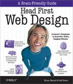

http://www.headfirstlabs.com/books/hfwd/

##Chapter 1. Building Beautiful Web Pages

Need to thinking in navigation twice in the design process:
1. Think about navigational elements (buttons and nav bars) while working in the overall layout
	
2. Writing code and building the layout elements as well as linking your pages together

You need to start by organizing your top level navigation. Keep your IA diagram close at hand.

###DETERMINE YOUR TOP LEVEL NAVIGATION

###SKETCHES KEEP THE FOCUS ON FUNCTIONALITY
Draw at least three more concepts on your own sheets of paper.

###CODE THE PROTOTYPE

###SCANNABILITY
Instead of reading your content from left to right, beginning to end, like a book, users scan the text for keywords and concepts—to give them an idea about the contents of the page. 

####Scannability Checklist
* You don’t have to use them all, just the ones that work for your content.
* Clearly written headers
* Small(ish) paragraphs
* Use bold and italics to emphasize important words or phrases.
* Use lists (ordered or unordered) for appropriate content.

###The process you followed in this chapter
* **Pre-production** using Information Architecture and storyboards to build a blueprint for your site so that you’re as efficient and focused as possible when you go digital.
* **Navigation** is based on your IA diagram. It’s more than just linking pages together. Navigation helps your users find information.
* **Layout** uses HTML and CSS to build the site’s interface (which you already came up with on paper back in the pre-production phase).
* **Writing** “fills” the design up with the scannable content that your visitors come to the site for.

###BULLET POINTS
* When you design sites, you should practice user-centered design—creating sites that focus on meeting the needs of your users.
* A design process helps you structure a project so that you stay on task and get things done in an efficient manner.
* Most, if not all, web design projects have 4 components: pre-production, layout, navigation, and writing.
Information Architecture is the process by which your website’s content is broken into chunks and then organized hierarchically in relation to one another.
* Developing your site’s IA is a two step process: organizing your site’s information, and building an IA diagram.
* An IA diagram visually represents the hierarchical organization of sections and subsections of information in your site.
* Top level navigation usually links to those sections in your information architecture one tier below your home/main page.
* The design of your top level navigation depends on the overall design and layout.
* There are a handful of great models for designing top level navigation: horizontal tabs, horizontal buttons, vertical menu, vertical tabs.
* Storyboards are used to visualize your design and test basic layout concepts before you jump into code.
Storyboards are a great way to catch potential design problems before you spend time coding your site.
* Writing for the web is different than writing for print.
* Web users scan webpages instead of reading them from beginning to end.
* Web content needs to be written so that it’s scannable.

##Chapter 2. Pre-Production

**Visual Metaphor** can range from subtle (using colors that give the user an abstract feeling that the designer wants to associate with the site’s theme) to direct (using graphics that tie right into the site’s name or identity–like using graphics of rocket ships for a site called Rocket Ship Designs).

**Theme** is your site’s purpose and content. So, the theme of amazon.com is an online merchant that focuses mostly on books. The visual metaphor uses design elements (color, graphics, typography, etc.) that reinforce the site’s theme.

###BULLET POINTS
* When you pre-produce a site, you are able to try out design ideas on paper–thereby avoiding potential mistakes in coding which could cost time, effort, and possibly money.
* A visual metaphor leverages visual elements (images, icons, colors, or fonts) in order to unconsciously reinforce the site’s subject matter.
* When applying a visual metaphor to your site, be subtle and don’t overdo it.
* Storyboards are hand drawn concept art storyboards that are used to visualize your design as a complete entity.

##Chapter 3. Organizing Your Site

Information architecture is just a way to organize the content you already have into groups that are meaningful and logical both for you and for your users. 

Information architecture is all about taking a step back and really looking at what sort of content you’ve got... how does it all fit together?

###Card Sorting
1. A stack of 3x5 cards
2. A pen and a clear table (or the floor)
3. A solid idea of your site’s content

###IA Diagrams are NOT just links between pages
IA diagrams are not about links—they’re all about the hierarchical relationship between sections and subsections of content. If you were to try to create a diagram that showed links between sections, you would end up with a useless, spaghetti-looking mess that wouldn’t give you any kind of information whatsoever about this vital hierarchical relationship between the site’s content.

Think about it like this... most sites have links all over the place, cutting across categories and site sections. That would make for a pretty messy IA!

###Pre-production to production: The complete process
1 Gather all the your content.

2 Brainstorm a theme and visual metaphor ideas.

3 Develop a visual metaphor and think about layout.

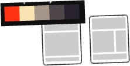

4 Build a storyboard (on paper).

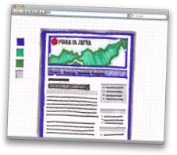

5 Do a few card sorts and create an IA diagram.

6 Markup your content and style with CSS.

###BULLET POINTS
* The point of a website is to communicate information–if that information is organized badly, your users will leave and not come back.
* The organization of a site’s information has a direct impact on its navigation and usability.
* Card sorting is a cheap and easy technique used to impose an information structure on a site’s content.
* Never rely upon your own card sort of a site’s information–you aren’t designing for yourself, you are designing for the site’s audience.
* A card sort often results in orphaned cards–which are a clear indication of content that should either be rethought or discarded entirely.
* An Information Architecture (IA) diagram is a representation of the hierarchical relationship between sections and subsections of the site’s information.
* Information Architecture diagrams are not designed to show the links between pages in a site.

##Chapter 4. Layout and Design: Follow the Golden Rule

###The Golden Ratio

If you take a length of a line and multiply by .62, you get a ratio that can be used to create a pleasing, natural-looking grid—that’s the Golden Ratio!

###The rule of thirds: A shortcut to the Golden Ratio

The Golden Ratio says that if you take the entire width of something, and multiply it by 0.62, you’ll get a nice wide area that you can put content into. The remaining 0.38 is great for sidebars, extra content, things that the eye should look at second.

Fortunately, 0.62 is awfully close to 2/3... and the remaining 0.38 is pretty close to 1/3. So if you divide something into thirds, two of those thirds are perfect for your main content, and the remaining 1/3 is great for sidebars, navigation, blogs...

###Important content should “weigh” more.

You should already be putting your most important content into the 2/3 part of your 2/3-to-1/3 page ratios. But is that the only way to draw attention to something? Not at all!
When you’re laying out your page, you’re creating a balance between larger elements and smaller ones. The larger elements have more weight, and the smaller ones have less weight. Plus, there’s how the elements relate to each other:

When you are laying out your web page, you need to consider two kinds of balance: symmetrical and asymmetrical.

**Symmetrical balance** occurs when elements on either side of a line (either horizontal or vertical) have the same weight.

**Asymmetrical balance** occurs when the weight of a site’s elements is not evenly distributed around a central line. So you’ve got one really large element only partially offset by other, smaller elements.

###BULLET POINTS
* A survey is an excellent way to get broad information about your audience.
* A persona is an archetype user that embodies and represents your audience.
* Screen real estate refers to the amount of space on the screen of the device that the designer has to work with.
* The lower your resolution, the larger items will be and the more screen real estate they will take up.
* A grid can provide order and visual logic when you are designing your layout on paper.
* The Golden Ratio can produce designs that are more pleasing to the eye.
* The rule of thirds is a quick and easy way to create grids that are based on the Golden Ratio.
* A CSS grid-based framework is a specialized CSS file that contains all of the necessary styles for laying your site out along a grid in CSS.
* The goal of a CSS grid-based framework is to allow the designer to focus on tasks that are unique to their specific project, rather than reinventing the wheel each time around.
* Block hover navs provide users with inf

##Chapter 5. Designing With Color: Moving Beyond Monochrome

###The color wheel (where it all begins)
The color wheel (or color circle as it’s sometimes called) is a circular diagram that displays different colors and shows the **relationship** between those colors.

Those relationships are key... and the color wheel lets us choose colors that go well together. 

**Color schemes** are more than just collections of colors. A color scheme is a certain grouping of colors that goes well together.

And here’s the kicker: all good color schemes start with a single color and your handy-dandy color wheel.

####First, choose your __BASE__ color
The color that most represents the visual metaphor and that all other colors are based on. Then, we base everything else—other colors, their depth, their hue—off of that base color.

####Use the triadic scheme to create usable color patterns

The **triadic color scheme** is one of the most commonly used color schemes around. Triadic uses **three** colors, **equally spaced** around the color wheel. So once you pick your base color, you can just draw an equalateral triangle (three equal sides), and pick your other two colors:

The great thing about the triadic color scheme (or any other type of color scheme) is that as long as you stick to the general location of a color on the color wheel, you can change its saturation. **Saturation** is just a fancy design term for the darkness or lightness of a color. So we can lighten the saturation of our color scheme... it’s the same colors, but a lighter feeling result.

####Create a richer color palette with the tetradic color scheme

When people find a site boring, that may mean the colors are too light... but we already know that Sam doesn’t like a darker triadic color scheme for SampleRate. So if you can’t go darker, consider adding colors. In other words, go from a three-color scheme to a four-color scheme.

One of the most common four-color schemes is the **tetradic color scheme**. The tetradic color scheme (which is sometimes also called the **double complementary scheme**) is the richest of all the schemes because it uses four colors arranged into two complementary color pairs.

Be careful, though. Four different colors is a lot to deal with, and you can’t use all four colors equally or your site will look like a mess. But for adding some extra complexity and energy to a site, a fourth color can really make a difference.

	
**Question:** Are there only two color schemes? Triadic and tetradic?

**Answer:** No, there are a bunch of others. Most of the them are simpler schemes: monochromatic, analogous, complementary, and split complementary. All of the schemes follow the same general principles as triadic and tetradic. They find colors related to each other by certain angles that go well together. For more information on these and other color schemes, check out http://www.color-wheel-pro.com/color-schemes.html

**There’s no golden rule for color placement.**

But there are definitely some **principles** you can apply:

####Create contrast

If you want to separate different areas of your layout (say a main column and sidebar), use **contrasting** colors. This contrast creates a border between two areas. That border lets users know that the two areas are different and probably have different functions or uses within the context of the site.

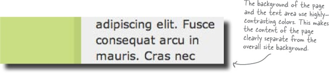

####Emphasis-o-matic

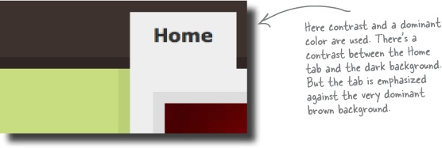

###BULLET POINTS
* Color has a powerful impact on your site’s visitors.
* Use the color wheel to choose colors for your site’s design.
* Color schemes are tools to help you choose a harmonious color palette.
* The triadic color scheme has three colors spaced equally from around the color wheel.
* The triadic color scheme is popular because it provides strong visual contrast while retaining balance, color richness, and harmony.
* The triadic scheme is not as contrasting as some other schemes.
* The tetradic color scheme has 4 colors arranged into two complementary color pairs.
* The tetradic color scheme is the richest of all the schemes.
* The drawback to the tetradic scheme is that it’s sometimes hard to harmonize.
* Use a tool like Kuler to create a color palette (and get the hex values of the colors in the palette).

##Chapter 6. Smart Navigation

###Navigation problems
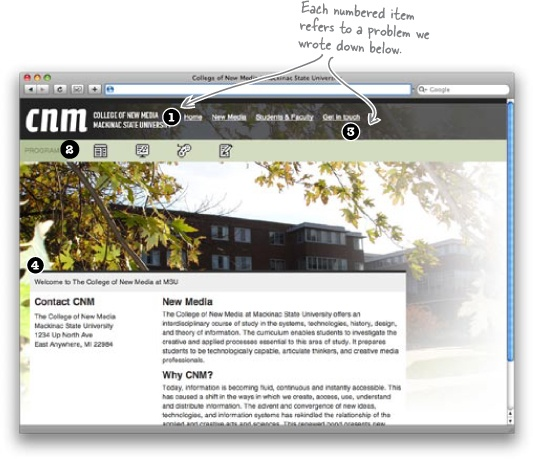
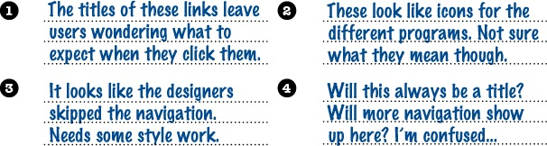

###The first step to good navigation is good IA

The names of your links are more than just helpers for your users. They’re actually the categories that organize your entire site. And most of the time, a bad link name means someone wasn’t thinking about navigation way back at the information architecture stage.

The CNM IA diagram looks like:

The IA of the CNM site seems to be organized fairly well... but the category titles are horrible. What in the world do they actually mean? 

####What’s really in a name, anyway?
The names that you give your navigational elements (links, buttons, etc.) have a direct impact on the usability of your site. In other words, names are a really big deal on the Web. You should put a lot of thought into the name you use for each of your IA categories and navigational elements. Here are some general guidelines to help you come up with good names:

####1. **Keep names _short_**. 
Make sure that your names are as short as possible. You want your user to be able to scan a name quickly. One word is ideal. Only use two if you really need that extra word. Avoid using words like “the” or “a” in names, too. Those are just a wasted of space. 

_Q: What if I simply can’t make the name of the navigational element one word?_

A: More than one word is ok as long as its completely necessary to tell your user exactly where they will end up when they click the nav element. Pick a name that won’t lead the user down a path they didn’t want to travel, rather than one that’s just clever and articulate.
    

####2. **Keep names descriptive**. 
Make sure that the name you choose is as clear and straight to the point as possible. You don’t want your users to look at a link and be confused. If you’re not 110% sure what a name means, your users sure won’t be, either.

###The Web is both __VISUAL__ and __SEMANTIC__
We’ve mostly been focusing on how sites look, but there’s another element to the Web: the semantic Web. Right now, our navigation links look good, but they’ve got no meaning. Really, those links are a list of items that are all part of the site’s navigation.

What we need is a way to give some semantic meaning to our list of links. Of course, XHTML gives us a couple of list elements, so let’s start there:

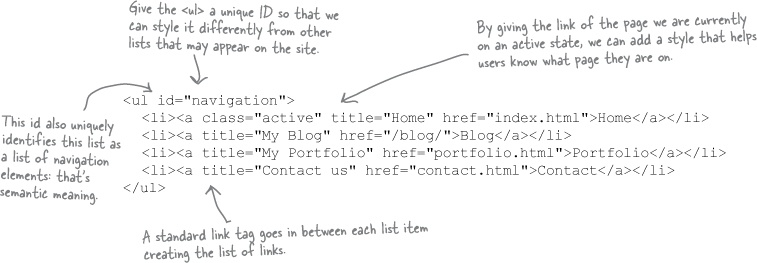

####Inconsistent navigation confuses users.
We base the way in which we interact with the world around us on the predictability of events. Every day millions of people pull up to a red light, wait for it to turn green, and then continue driving. But what if you pulled up to a red light and instead of it turning green, it turned blue? You’d probably have absolutely no clue what to do.
Navigation works in a similar way. When a navigational system works right, people rely on it. In the CNM system, the navigation isn’t what users are expecting. That’s because it probably violates at least one of the following three principles:
Navigation should be in a place users expect it to be: usually the top of a page or along either side.
Links should look like links. They should appear to be “clickable” for users.
Links should be clearly identified and separate from each other.

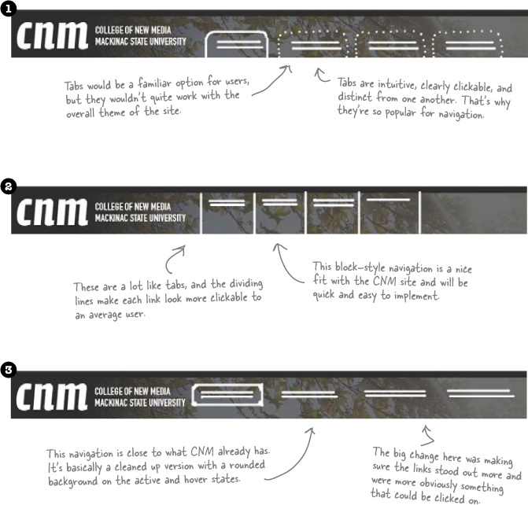

####The navigation icons

Those little icons are terrible!
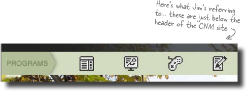
**Confusion is the enemy of good web design. If something’s confusing to you, it will probably be VERY confusing to your users.**

Icons don’t **SAY** anything... they just look pretty

Yes, icons are cool little design elements. The problem is, when used for navigation, they can cause some serious problems. What does an icon mean? What happens if you click on it? Where will the site take me?

What one icon represents to you might be completely different from what it represents to another person. And if you use an icon as a navigational element, your users might get the wrong impression about where they will end up if they click the icon.

**When in doubt, _ADD TEXT_.**
Sometimes you’re gonna get stuck with a bad display element, or perhaps just some meaningless or confusing icons. If you’re not able to make major changes, one easy fix is to simply add text, clarifying the icons or explaining how to use a particular page element.
A little bit of clarifying text goes a long way to let a user know what to click or where to go on a page.

###Primary navigation shouldn’t change... but secondary navigation SHOULD

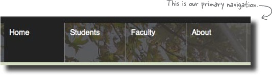
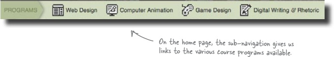

**Primary navigation** applies to your **ENTIRE** site.
**Secondary navigation** applies to the **CURRENT SECTION** of a site you’re on.

###BULLET POINTS
* Use your site’s information architecture as the foundation for navigation.
* Primary navigation is the navigation that provides links to the main sections of the site. Secondary navigation is navigation that links to subsections of the site.
* When naming your navigational elements, make sure you use labels that are both short and descriptive.
* Horizontal navigation designs work particularly well with one and two-column layouts.
* If your site has a vertical design for its primary navigation, make sure that you don’t put secondary navigational elements higher on the page.
* The goal of navigation is to tell your users where they are in the overall architecture of your site and provide them with the means to make decisions about where they want to go from there.
* In order to avoid confusion, make sure you keep your navigation consistent across your entire site.
* Make sure that your users can learn your navigation system quickly.
* Breadcrumb trails give the user a visual indication as to the location of their current page in the site’s overall information architecture.
* Never use icons (on their own) as navigational elements—what an icon means to you could be completely different from what it means to someone else.
* If you want to use icons as navigational elements, make sure you also use text in order to provide a clear indication of where your users will end up if they click on the link.

##Chapter 7. Writing for the Web: Yes, You Scan!

People don’t read text on the Web like they read text on a printed page. Instead of reading text from left to right, beginning to end, they scan it. All of the text on your site needs to be quickly **_scannable_** and **_easily digestible_** by the user. 

###Mix fonts to emphasize headings and other text

Using a different font for your site can dramatically change the feel and emotion of the design. On top of that, different fonts can make your text more readable and make life easier for your users. There are two distinct categories of fonts for the Web: **serif** and **sans-serif**.

A mix of serif and sans-serif fonts can add a nice touch to pages and help separate content from headings. It also allows you to render serif fonts at a larger size and keep the body content in a sans-serif that can be safely displayed in a smaller size.

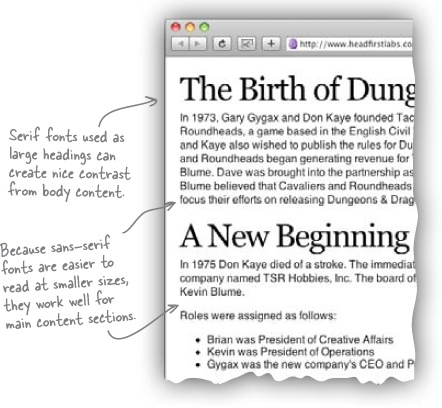

**Serif** fonts look like Times New Roman and are defined by the small projections—or “serifs”—that extend off the main stroke of the character.

**Sans-serif** means “without (sans) serif” and is composed of font families like Helvetica and Arial. Sans-serif fonts are easier to read on screen because the relatively low resolution of computer monitors makes serif fonts look blurry, especially at smaller sizes.

This doesn’t mean you can’t use serif fonts on the Web; they just need to be used properly and rendered large enough so that they can be easily read by your users.

http://www.webstyleguide.com/type/face.html

###The level, not the size, of a heading conveys importance

HTML comes out of the box with six different header levels: < h1> through < h6>. With no stylesheet (just the naked markup), most browsers will render < h1> in the largest text and < h6> in the smallest.

Remember, HTML’s a markup language and isn’t intended to convey style information. The different heading levels are used to signify importance in your content. A level one heading < h1> is the most important heading, < h2> is the next-most important, and so on.

###BULLET POINTS
* People read text off of a screen 15% slower than off a printed page.
* The low resolution of monitors (compared to a printed page) often results in eye straining–making it uncomfortable to read text off a screen.
* On the Web, people don’t read text like they do on a printed page. Instead, they scan it, looking for keywords, sentences, and paragraphs that are meaningful to them.
* Write your text like an inverted pyramid—with a general summary at the beginning and detail after. The idea is that users can stop reading at any time and still be confident in the fact that they’ve already gotten the most important pieces of information.
* Always write at least 15% less text for a website than you would for a print document.
* Use lists to break up large blocks of text and give the user’s eye something to latch onto when they are scanning your page.
* Headers make text more scannable. Not only do they break up large blocks of text, but they also tell the user what the paragraph is about.
* Sans-serif fonts are easier to read on a screen than serif fonts, especially at smaller font sizes.

##Terms

IA (Information Architecture).

Navigation elements.

Layout elements

Blueprint

Sketches

Storyboards: (Sequence of little sketches that look like a comic strip—the film industry uses to test out shots before rolling the cameras) - or comp (composition)

Wireframes: storyboards

Visual Metaphor: can range from subtle (using colors that give the user an abstract feeling that the designer wants to associate with the site’s theme) to direct (using graphics that tie right into the site’s name or identity–like using graphics of rocket ships for a site called Rocket Ship Designs).